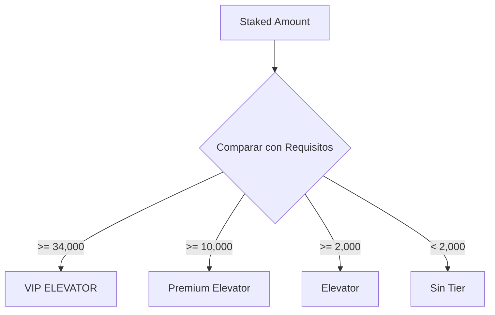

# 📚 Documentación Técnica - OXS Tier System

## 🏗️ Estructura del Contrato

### OXSTier.sol
```solidity
contract OXSTier is IOXSTier, TierManagement {
    IERC20 public oxsToken;
    uint256 public constant DECIMALS = 18;
}
```

### Estructuras de Datos

#### TierInfo
```solidity
struct TierInfo {
    string name;           // Nombre del tier
    uint256 requiredTokens; // Tokens requeridos para el tier
    uint256 cashValue;     // Valor en efectivo del tier
    uint256 conversionRate; // Tasa de conversión
    bool isActive;         // Estado del tier
}
```

#### UserTierInfo
```solidity
struct UserTierInfo {
    uint256 currentTier;   // Tier actual del usuario
    uint256 stakedAmount;  // Cantidad stakeada
    uint256 lastUpdate;    // Última actualización
    bool isActive;         // Estado del usuario
}
```

## 🔄 Flujo de Datos

### Actualización de Tier
1. Usuario stakea tokens
2. Se llama a `updateUserTier`
3. Se calcula el nuevo tier
4. Se actualiza la información del usuario
5. Se emite evento `TierUpdated`

### Cálculo de Tier


## 📊 Variables de Estado

### Constantes
- `TOKEN_PRICE`: 15 (0.15$)
- `MAX_TIERS`: 3
- `DECIMALS`: 18

### Mappings
- `tiers`: Almacena información de cada tier
- `userTiers`: Almacena información de usuarios
- `isTierActive`: Control de estado de tiers

## 🔐 Control de Acceso

### Funciones de Owner
- `addTier`: Añadir nuevo tier
- `updateTier`: Modificar tier existente

### Funciones Públicas
- `updateUserTier`: Actualizar tier de usuario
- `getUserTierInfo`: Consultar información de usuario
- `calculateTier`: Calcular tier basado en stake

## 📈 Eventos

### TierUpdated
```solidity
event TierUpdated(
    address indexed user,
    uint256 oldTier,
    uint256 newTier,
    uint256 timestamp
);
```

### TierAdded
```solidity
event TierAdded(
    uint256 indexed tierId,
    string name,
    uint256 requiredTokens,
    uint256 cashValue,
    uint256 timestamp
);
```

### TierModified
```solidity
event TierModified(
    uint256 indexed tierId,
    string name,
    uint256 requiredTokens,
    uint256 cashValue,
    uint256 timestamp
);
```

## 🧮 Cálculos

### Conversión de Tokens a Efectivo
```solidity
cashValue = stakedAmount * conversionRate / 1e18
```

### Cálculo de Tier
```solidity
if (stakedAmount >= 34000) return 3;  // VIP
if (stakedAmount >= 10000) return 2;  // Premium
if (stakedAmount >= 2000) return 1;   // Elevator
return 0;                             // Sin tier
```

## 🔍 Validaciones

### Entradas
- Direcciones no nulas
- Cantidades positivas
- Tiers válidos (1-3)
- Límites de tokens

### Estados
- Tier activo
- Usuario activo
- Balance suficiente

## 🛡️ Consideraciones de Seguridad

### Reentrancia
- Uso de checks-effects-interactions
- No hay llamadas externas críticas

### Overflow
- Uso de SafeMath (Solidity 0.8+)
- Validación de límites

### Acceso
- Control de owner
- Validación de permisos

## 📊 Gas Optimization

### Variables
- Uso de uint256 para optimización
- Packing de variables cuando es posible

### Funciones
- Minimización de storage reads
- Uso de memory vs storage
- Optimización de loops

## 🔄 Integración

### Frontend
```javascript
// Ejemplo de integración con web3.js
const tierContract = new web3.eth.Contract(ABI, address);

// Actualizar tier
await tierContract.methods.updateUserTier(user, amount).send({from: user});

// Consultar tier
const userInfo = await tierContract.methods.getUserTierInfo(user).call();
```

### Backend
```javascript
// Ejemplo de integración con ethers.js
const tierContract = new ethers.Contract(address, ABI, signer);

// Escuchar eventos
tierContract.on("TierUpdated", (user, oldTier, newTier, timestamp) => {
    console.log(`User ${user} updated from tier ${oldTier} to ${newTier}`);
});
```

## 🐛 Debugging

### Eventos de Error
- "Direccion invalida"
- "Tier invalido"
- "Tier no activo"
- "Maximo numero de Tiers alcanzado"

### Logging
```javascript
// Ejemplo de logging
console.log("Tier Info:", {
    name: tierInfo.name,
    required: tierInfo.requiredTokens.toString(),
    value: tierInfo.cashValue.toString()
});
```

## 📈 Monitoreo

### Métricas Clave
- Número de usuarios por tier
- Distribución de stakes
- Tasa de conversión promedio
- Volumen de actualizaciones

### Alertas
- Cambios en tiers
- Actualizaciones de usuarios
- Errores de transacción
- Eventos críticos 